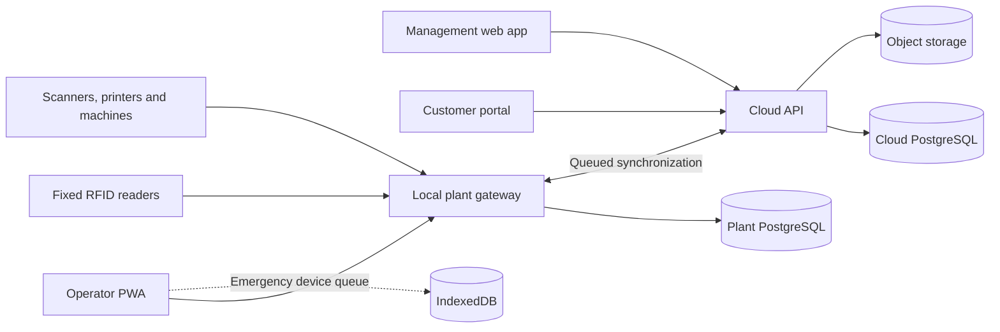

# Architecture

## Context

The product combines business administration, shop-floor workflows, and industrial device integration. Cloud availability improves coordination but must not be a prerequisite for normal plant production.

## Technology baseline

| Concern | Baseline |
|---|---|
| Management UI | Next.js, React, TypeScript |
| Operator UI | React, Vite, PWA service worker, IndexedDB |
| Cloud backend | ASP.NET Core on .NET 10 LTS |
| Edge gateway | .NET worker/service with adapter processes where required |
| Primary storage | PostgreSQL in cloud and at each plant |
| Short-lived cache | Redis only where measured need exists |
| Realtime UI | SignalR/WebSocket |
| Cloud-edge transport | HTTPS initially; MQTT 5 where its delivery model is useful |
| Files | S3-compatible storage or Azure Blob Storage |
| Identity | OpenID Connect; Microsoft Entra ID or Keycloak baseline |
| Observability | OpenTelemetry logs, metrics, and traces |
| Deployment | Containers; managed container platform before Kubernetes |
| Infrastructure | Terraform or OpenTofu |
| Testing | xUnit, Testcontainers, Playwright, simulators, resilience tests |

## Cloud application

Use a modular monolith with explicit modules:

- Identity and access
- Tenants and plants
- Customers and contracts
- Textiles and inventory
- Production
- Logistics
- Billing
- Reporting and audit
- Integrations

Modules own their domain rules and persistence mappings. Cross-module changes use explicit application contracts. Start with one API deployment and one worker deployment; extract a service only when scaling, availability, security, or independent release requirements justify it.

## Plant gateway

Run a gateway on a managed industrial PC or plant server. It:

- Provides a stable local API to operator stations.
- Durably accepts scans and production events.
- Translates vendor protocols into canonical project events.
- Buffers outbound events and receives relevant configuration changes.
- Manages RFID readers, label printers, scales, and machine adapters.
- Exposes device health and synchronization diagnostics.
- Continues operating during WAN or cloud outages.

Do not expose plant equipment directly to the public internet.

## Operator application

The operator PWA is a separate deployable frontend sharing design components and generated contracts with the management application. It is optimized for large touch targets, scanner input, minimal typing, kiosk use, clear sound/visual feedback, and multilingual operation.

The PWA normally talks to the plant gateway over the LAN. IndexedDB is an emergency queue when even the gateway is temporarily unreachable; it is not the durable plant system of record.

## Device integration

- Keyboard-wedge barcode scanners can feed focused PWA inputs.
- Fixed RFID portals and conveyors connect to the local gateway.
- Advanced handheld RFID may require a thin native Android shell or vendor SDK adapter.
- Each vendor integration implements a project-owned adapter interface.
- Simulators must reproduce normal reads, read storms, disconnects, malformed payloads, and retries.

## Data ownership

- The gateway is authoritative for whether a local event was durably accepted while disconnected.
- The cloud is authoritative for consolidated state across plants.
- Immutable operational events synchronize; current views are projections of accepted state transitions.
- Ordinary relational tables represent current business state. Full event sourcing is not required.

## Deployment environments

- Local development: containerized dependencies and device simulators.
- Development: shared cloud environment with disposable plant gateway instances.
- Staging: production-like identity, networking, migration, and synchronization tests.
- Production: managed cloud services and separately managed plant installations.

Each release must define cloud/edge compatibility. The gateway must tolerate a temporarily newer or older cloud version within the supported compatibility window.

